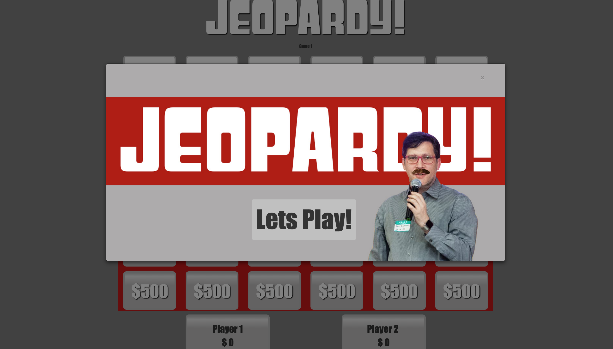
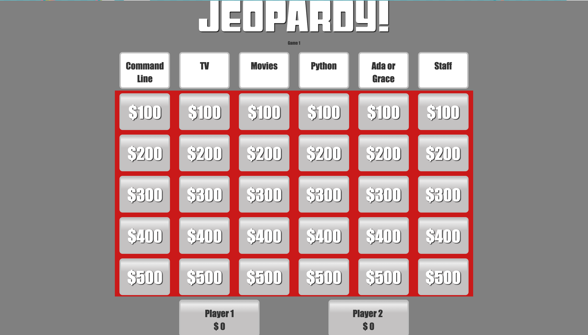
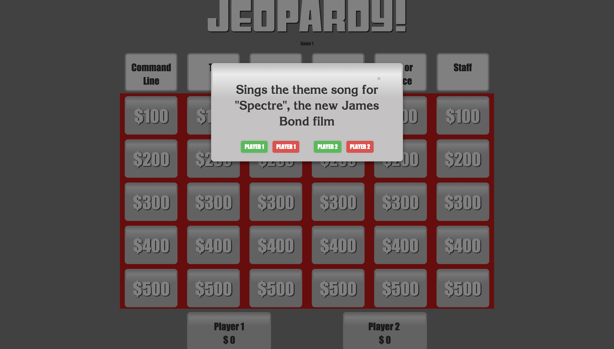
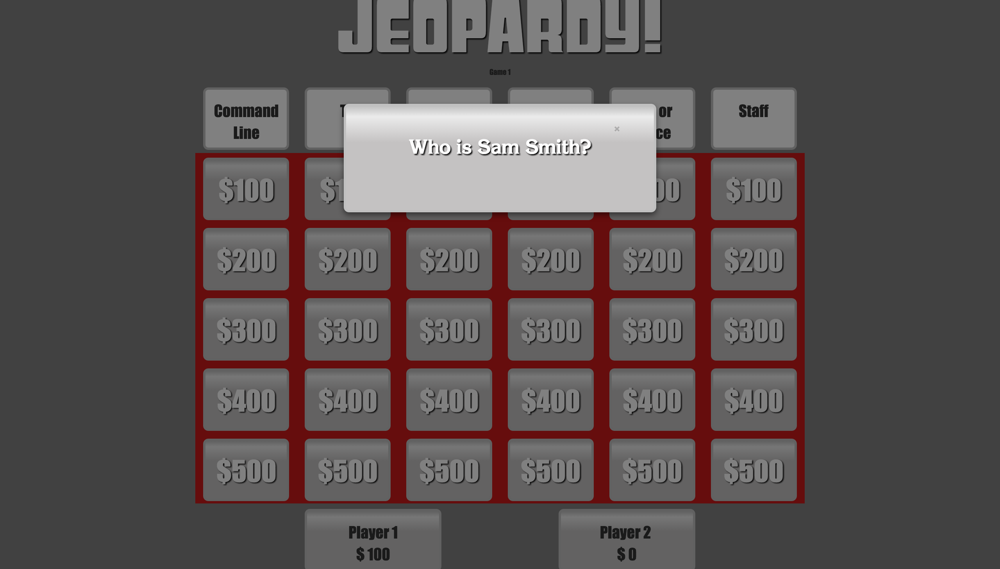
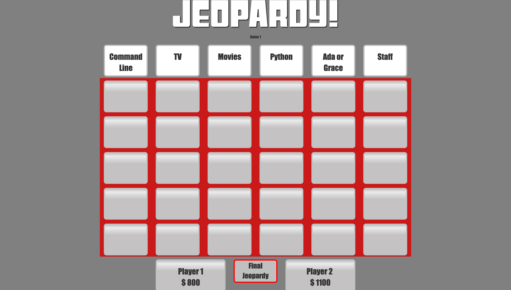
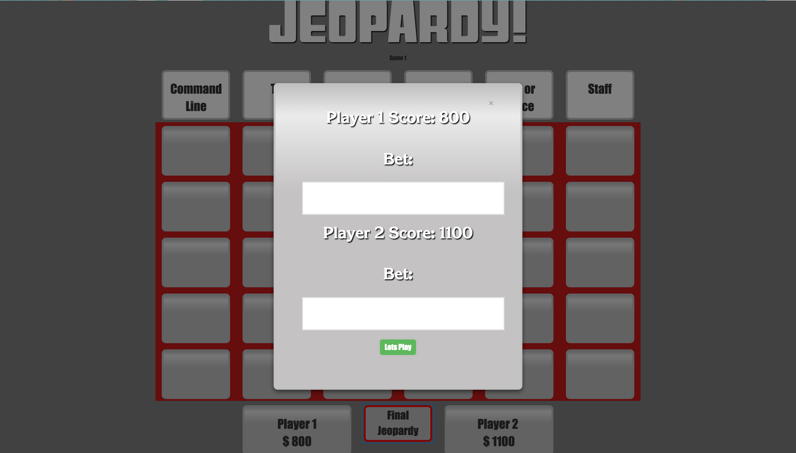
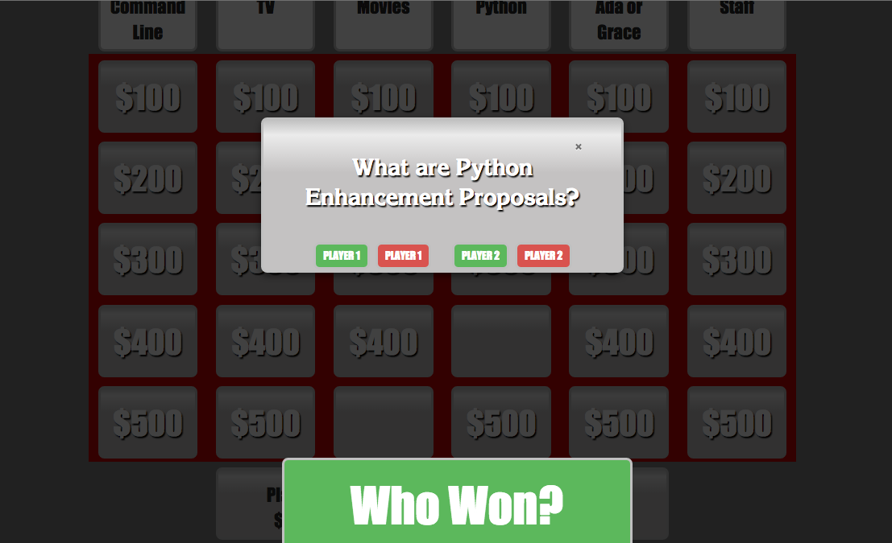
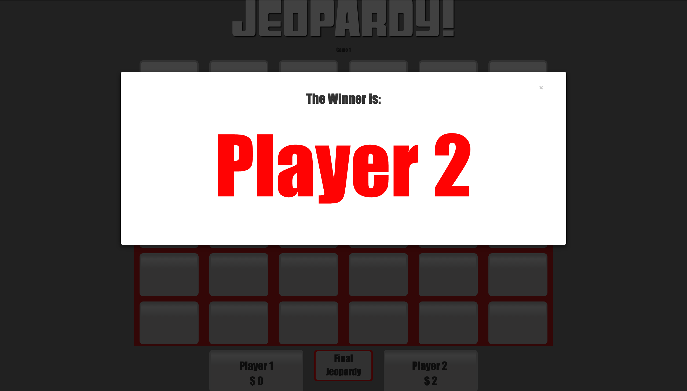

Hackbright Jeopardy
-------------------

**Description**

A Jeopardy! inspired Angular Web App, infused with Hackbright Academy questions and colors.

**How it works**

Using Angular's angularModalService, it allocates information from the $scope.round object of the categories, dollar amounts, questions and answers to the appropiarte position. 

Users can click on the dollar amount and a modal pops up that allows players to regiester their response. As the game continues, the score is update in real time. 

When the questions have all been answered, final jeopary button appears 

More detail information: [Jeopardy in Angular](https://chatasweetie.com/2016/07/21/jeopardy-in-angular/)

### Screenshot

**Splash Screen**

**Starting Board**

**Question**

**Answer**

**Final Jeopardy Button Appears**

**Final Jeopardy Betting**

**Final Jeopardy Question**

**Winner**

About the Developers:
---------------------

Jessica Dene Earley      
&nbsp;&nbsp;&nbsp;&nbsp;&nbsp;&nbsp;[Linkedin](https://www.linkedin.com/in/jessicaearley)    
&nbsp;&nbsp;&nbsp;&nbsp;&nbsp;&nbsp;[Blog](https://chatasweetie.com/)    
Leslie Castellanos     
&nbsp;&nbsp;&nbsp;&nbsp;&nbsp;&nbsp;[Linkedin](https://www.linkedin.com/in/lesliecastellanos)
